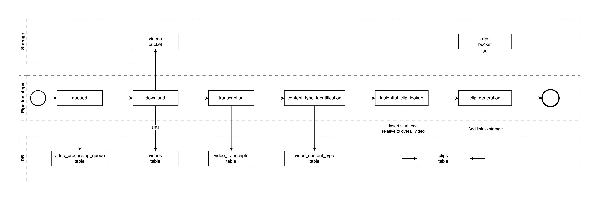

# MadVision sample

## Overview

The task is to create a robust server-side pipeline for downloading and processing videos from the net.

The processing steps are:

1. Download to internal storage.
2. Generate a transcript (OpenAI Whisper)
3. Identify content type (GPT4o)
4. Lookup insughtful clips (GPT4o)
5. Clip generation.

## Issues

1. Videos may be large -- a download takes time, and may fail at any moment due to a variety of reasons.
2. Transcription is run on own servers. It is resource-intensive, may be a performance bottleneck.
3. Steps 3-4 rely on a third-party API -- outages may occur.
4. We may need to manage resources, processing many videos in parallel may be expensive.

## General solution

The above problems could be covered in general by:

1. A processing queue mechanism, and
2. persisting the result of every pipeline step.

This allows us to retry from the latest checkpoint, while avoiding doing the same work twice.

Besides, this gives us flexibility to increase or reduce the number of workers for the system, so we can manage the balance between horizontal scaling and expenses for it.

### Implementation

The approach can be implemented in a variety of ways:

#### 1. Barebones AWS

- EC2 for CUDA-enabled server runtime.
- SQS for the queue.
- S3 for storage
- RDS for a DB.
- AWS step functions to link some of the pieces.

Pros:

- Extremely flexible.
- Great monitoring tools.

Cons:

- Initial setup and maintenance overhead is substantial.
- May be expensive if not careful about the config.

#### 2. Self-hosted on a VPS

- Kafka/RabbitMQ or analogues for the message queue.
- Postgres for the DB.
- Managed or self-managed storage.

Pros:

- Maximum flexibility.
- May be cheaper in terms of external operation costs.

Cons:

- Probably needs a dedicated DevOps on the team.

#### 3. Supabase

- A simple queue implementation using Postgres.
- Supabase Storage (backed by AWS S3 under the hood).

Pros:

- Initial setup and mainatenance overhead is minimal.
- Relatively low costs for DB and Storage.

Cons:

- Still need an external runtime for running Whisper-powered transcription (ideally needs and env with CUDA-enabled GPUs)

## Supabase + Python implementation example

1. Video Submission:
   - Users submit videos via the `/public/video` endpoint.
   - The server adds the video URL to the `videos` table and creates an entry in the `video_processing_queue` table.
   - A unique token is returned to the user for status tracking.

2. Processing Queue:
   - The `video_processing_queue` table manages the processing pipeline.
   - It tracks the status and current processing step of each video.
   - The queue allows for prioritization and retries in case of failures.

3. Video Processing:
   - The `/internal/perform-video-processing` endpoint handles the actual processing.
   - Each step updates the `pipeline_step` in the queue table, allowing for checkpoint-based retries.

4. Status Tracking:
   - Users can check the status of their video processing via the `/public/video/status` endpoint using their token.

5. Error Handling and Retries:
   - If an error occurs during processing, it's logged in the queue table (`failure_cause` and `failure_details`).
   - Non-fatal errors allow for automatic retries, with the `retry` count tracked in the queue.

6. Scalability:
   - The queue-based system allows for easy horizontal scaling by adjusting the number of workers and threads in `gunicorn.py`.
